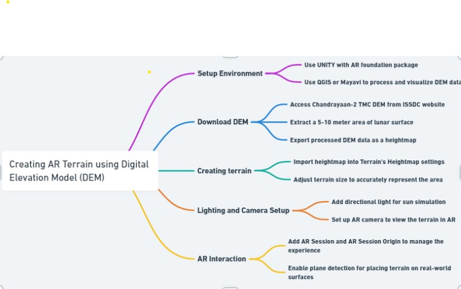

# LunarDarshan - an AR simulation of the lunar surface for education and reasearch

## Features:
1. Interactive Learning Tool: By creating an AR application, we provide an immersive and interactive way to explore the lunar surface, enhancing educational experiences.
2. Accessible Data Visualization: Transforming DEM data into an AR experience makes high-resolution lunar data accessible and engaging to a wider audience, including researchers, students, and space enthusiasts.
3. Enhanced Research Capabilities: Scientists and researchers can use this tool to visualize and analyze the lunar terrain more effectively, aiding in mission planning and geological studies.

## Mockup photos of the prototype: 

## Workflow: 

## Demo Link
<a href="https://drive.google.com/file/d/10m5CT03eIX5jb3ZagljKjFY6hbXMvfUk/view?usp=sharing"> protype link </a>

